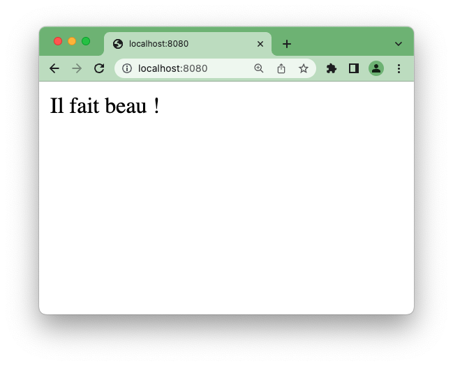

# Application Spring-Boot meteo

Expose un service REST donnant la météo courante à [Saint-Mandé](https://www.qwant.com/maps/place/admin:osm:relation:108318?client=search-ia-maps-single#map=13.52/48.8414821/2.4197749)

La météo est obtenue d'une API externe via un client REST basé sur `RestTemplate`.

(Voir l'historique des commits pour les différentes briques de l'application)
## Lancement de l'application

````sh
mvn spring-boot:run
````



NB : Il faut Java (JDK) 17 ou plus.  
Si erreur, le vérifier avec `mvn -version`

## Accès au enpoint

http://localhost:8080/


## Accès à Swagger

http://localhost:8080/swagger-ui/index.html

## Lancement des test unitaires

````sh
mvn test
````

## Lancement complet des tests

Y compris les tests d'intégration

````sh
mvn integration-test
````

(Cette commande lance aussi les étapes `test`et `package`)